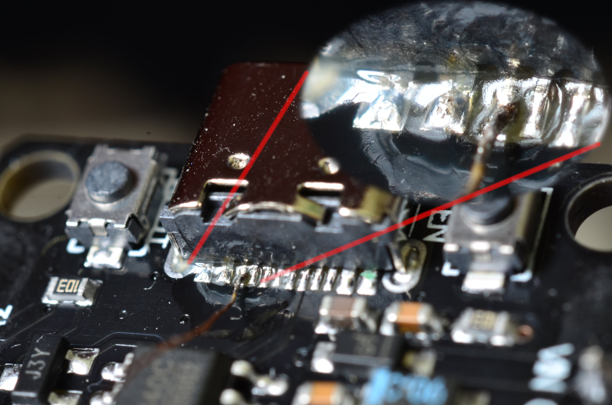

# Hardware
  * ESP32 DevKit (mit USB-C oder Mikro-USB Anschluss), CHF 3.50
    * https://www.aliexpress.com/item/1005005495948290.html
  * WS2811 RGB-Lichter, CHF 8.50
    * https://www.aliexpress.com/item/1005004135240307.html
  * USB Kabel, CHF 1.50
    * https://www.aliexpress.com/item/1005004659540097.html
  * 3x Dupont Kabel

Total CHF 14.-

## Verbindung ESP <-> LEDS
In dieser Reihenfolge anschliessen, wenn der Microkontroller am Strom hängt.
Auf einer Seite sind diese Ports schön nebeneinander.
  * Weiss (GND, 0V)
  * Rot (VIN, 5)
  * Grün (D13)

Es kann sein, dass die Kabel einen Wackelkontakt haben. In diesem Fall müssen die Kabel in eine bestimmte Position gebogen werden, um den Kontakt zu gewährleisten.

## Sorgen mit USB-C Stromversorung
USB-C zu USB-C Kabel funktionieren nicht. Grund ist ein fehlender 5.1 kΩ Widerstand auf dem ESP32 Dev-Board.

Was Funktioniert ist ein USB-A zu USB-C Kabel. Oder ein Adapter von USB-C zu USB-A und dann wieder ein USB-A zu USB-C Kabel.

Oder man steckt einen USB-C zu USB-A Adapter in den ESP32 und testet die 
Widerstände zwischen GND und den Pins und findet dann relativ schnell den
Pin, dem ein Widerstand zu GND hinzuzufügen ist. Das zu Löten ist dann aber
etwas für ruhige Hände und gute Augen. Auch ein 5.5 kΩ Widerstand hat tip
top funktioniert und das Board erhält jetzt Strom. Ist ein interessanter
aber völlig unpraktikabler Fix.

Mehr dazu:
  * https://hackaday.com/2023/01/04/all-about-usb-c-resistors-and-emarkers/
  * https://community.infineon.com/t5/Knowledge-Base-Articles/Termination-Resistors-Required-for-the-USB-Type-C-Connector-KBA97180/ta-p/253544

