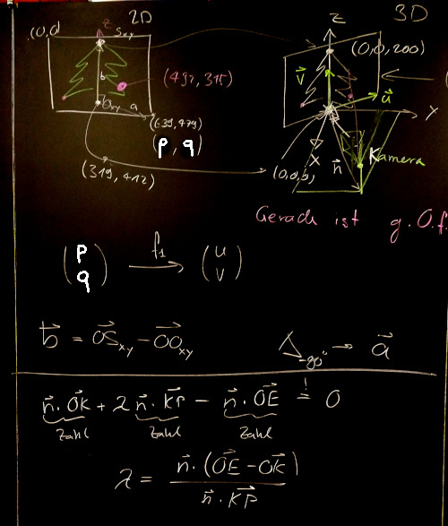
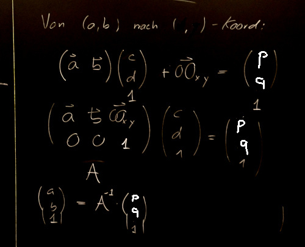
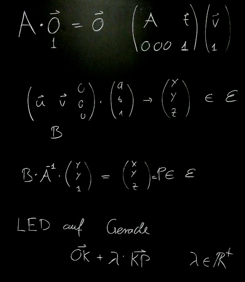
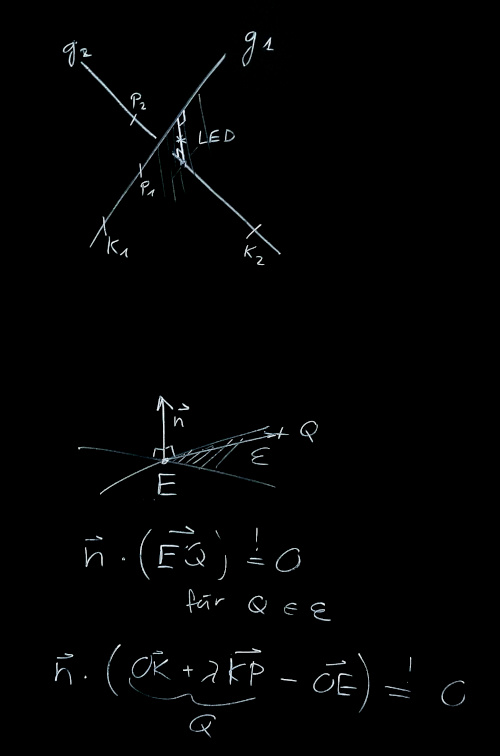

# Positionsbestimmung
## Nötige Daten
### Position und Messqualität
Wir gehen davon aus, dass wir für jede LED folgende Daten haben:

    0000 354 217 0.9

Nummer der LED, x- und y-Koordinaten des Pixels auf der Video-Aufnahme und eine Zahl zwischen 0.0 (völlig unzuverlässige Koordinaten) bis 1.0 (sichere und präzise Koordinaten).

### Weitere Daten zur Messung
  * Bildgrösse (640x480), wobei das gar nicht nötig ist, 
wenn die Punkte $S_1$ und $S_2$ automatisch erkannt werden.
  * Position der Kamera, Höhe von $S_2$ (höchste LED in cm über Boden)

#### Kameraposition, Baumposition

Koordinatensystem:
  * Nullpunkt: Schnittpunkt Baumachse mit Boden
  * z-Achse nach oben
  * x,y-Achsen parallel zu den Wänden, typischerweise $x$ nach vorne, $y$ nach rechts. (Rechtsdrehendes Koordinatensystem).
  * Einheit: 1cm

Die tiefste LED definiert $S_1 = (0,0,0)$, die höchste LED definiert $S=(0,0,h)$, wobei $h$ die Höhe in cm über Boden ist.

## Annahmen zur Kamera
  * Wir nehmen an, dass die Kamera 
«[rectilinear](https://en.wikipedia.org/wiki/Rectilinear_lens)» ist, was eher nicht so ist. Der Fehler sollte aber nicht zu gross sein (könnte man mit einer karrierten Wandtafel gut ausmessen).
  * Wir nehmen an, die Projektionsebene ist normal zur Kameraachse, was bei fast allen Kameras in bester Näherung auch so ist.

### Projektionsebene

 (Bild Wikimedia)

## Umrechnungen
Wenn immer möglich, werden wir Umrechnungen matriziell formulieren, damit können die Matrix-Funktionen von numpy verwendet werden. Damit können einfach Matrizen invertiert oder ganze Listen von Vektoren transformiert werden.
### Pixel-Position zu räumliche Koordinaten in der Projektionsebene

#### Notation
  * Pixel-Koordinaten auf dem Bild: $(p,q)$
  * Stamm $S_1$ und Spitze $S_2$:
     Gegeben in Pixelkoordinaten, in Raumkoordinaten $S_1=(0,0,0)$, $S_2=(0,0,200)$, oder wie hoch der Baum dann immer auch ist.
  * Baum-Koordinaten auf dem Bild: $(a,b)$, Einheitsvektoren $\vec a$, $\vec b$ mit Nullpunkt $S_1$ und $\vec b=\vec{S_1S_2}$.
  * Kameraposition $K=(k_x, k_y, k_z)$.
  * Projektionsebene $\epsilon$ durch $Z$, normal zu $\vec{OK_{xy}}$ (Projektion von $K$ auf die $x$-$y$-Ebene.)
  * Einheitsvektoren $\vec u$ und $\vec v=\vec{S_1S_2}$ spannen die Ebene $\epsilon$ auf.

#### What is the matrix?

 

Sei $A$ die $3 \times 3$ 
Matrix, die von $(a,b,1)$ auf 
$(p,q,1)$-Koordinaten umrechnet.
*Die zusätzliche Komponente 1 erlaubt es, auch Translationen mit einer Matrix zu beschreiben.*

$$A = \begin{pmatrix}
\vec a & \vec b & \vec{OS_1} \\
0 & 0 & 1 \\
\end{pmatrix} \vec v$$
wobei $\vec a$ und $\vec b$ im $(p,q)$-Koordinatensystem angegeben sind.

Es gilt also:
$$ A \cdot \begin{pmatrix} 
a \\ b \\ 1 \end{pmatrix} =
\begin{pmatrix}
p \\ q \\ 1 \end{pmatrix}
$$

$A$ ist invertierbar (weil die ganze Ebene auf sich selbst abgebildet wird), also ist
$$
\begin{pmatrix} 
a \\ b \\ 1 \end{pmatrix} = 
A^{-1} \cdot 
\begin{pmatrix}
p \\ q \\ 1 \end{pmatrix}
$$

Vom $(a,b)$ ins $(u,v)$ Koordinatensystem ist die Umrechnung gar nicht nötig, weil die Koordinaten die gleichen sind. Es bleibt also noch die Umrechung ins $(x,y,z)$-System mit der Matrix $B$:

$$B = \begin{pmatrix}
\vec u & \vec v & \vec 0
\end{pmatrix} \qquad \text{ damit ist } \qquad

\begin{pmatrix}
x \\ y \\ z \end{pmatrix} =
B \cdot 
\begin{pmatrix}
a \\ b \\ 1 \end{pmatrix}
$$
wobei die Vektoren $\vec u$ und $\vec v$ in
$(x,y,z)$-Koordinaten angegeben sind. 

$\vec u$ ist parallel zur 
$x$-$y$-Ebene und senkrecht zur Projektion von $\vec{OK}$ und gleich lang wie $\vec v$, d.h.
$$
\vec u = \frac{|\vec v|}{\sqrt{k_x^2+k_y^2}}\begin{pmatrix} -k_y \\ k_x \\ 0 \end{pmatrix}
$$

#### Zusammenfassung
Die Umrechnung von den Pixelkoordinaten $(p,q,1)$ 
auf den räumlichen
Punkt $P=(x,y,z)$ in der Projektionsebene 
$\epsilon$ erfolgt wie folgt:
$$
B \cdot A^{-1} \cdot
\begin{pmatrix}
p \\ q \\ 1
\end{pmatrix} = 
\begin{pmatrix}
x \\ y \\ z
\end{pmatrix}
= \vec{OP}
$$
mit den Matrizen definiert wie oben.

Die LED liegt also auf der Geraden
durch $K$ und $P$:
$$
g(t) = \vec{OK} + t \cdot \vec{KP}
$$
## Räumliche Position

Es gilt die aus verschiedenen Perspektiven erhaltenen Geraden «zu schneiden», die sich aber
praktisch kaum je schneiden werden.
Statt dessen bestimmt man den Punkt, der am nächsten zwischen beiden Geraden liegt, d.h. der Mittelpunkt der kürzesten Verbindung der beiden Geraden.

Die kürzeste Verbindung ist rechtwinklig auf beide
Geraden. Diese Richtung $\vec n$ 
erhält man mit dem Vektorprodukt der Richtungsvektoren der Geraden.
Die Ebene aufgespannt von $\vec n$ und der einen
Geraden, geschnitten mit der anderen Geraden ergibt
einen Punkt der kürzesten Verbindung.
Vertauscht man die Geraden, erhält man den anderen.
